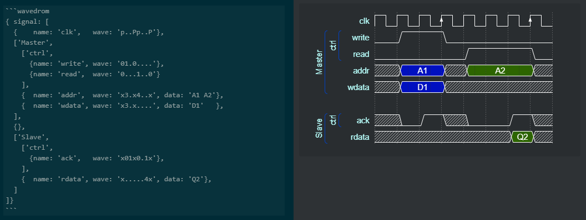

# Wavedrom renderer plugin for Inkdrop
 

A [Wavedrom](https://wavedrom.com/) renderer plugin for [Inkdrop](https://www.inkdrop.info/)


## Example
````
```wavedrom
{ signal : [
  { name: "clk",  wave: "p......" },
  { name: "bus",  wave: "x.34.5x",   data: "head body tail" },
  { name: "wire", wave: "0.1..0." },
  {}
]}
```
````

This will be rendered as


## Install

```sh
ipm install wavedrom
```

## Changelog
- 1.0.0
  - integrate wavedrom 2.6.8 for Inkdrop 5.x
